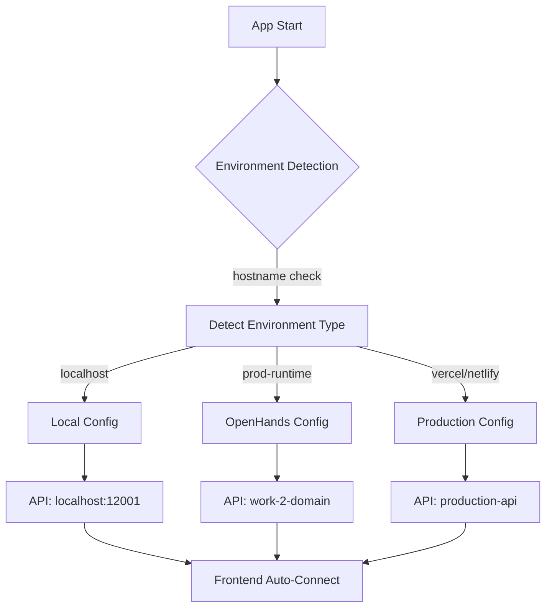

# 🔗 PHƯƠNG PHÁP KẾT NỐI FRONTEND VÀ BACKEND

## 🎯 **PHƯƠNG PHÁP SỬ DỤNG: DYNAMIC API CONFIGURATION**

### **Tổng quan:**
- **Tự động phát hiện môi trường** (Environment Auto-Detection)
- **Cấu hình động** (Dynamic Configuration)
- **Triển khai universal** (Universal Deployment)
- **Không cần config thủ công** khi chuyển máy

---

## 🏗️ **KIẾN TRÚC HỆ THỐNG**

### **1. Environment Detection Logic**

```typescript
// frontend/src/config/api-config.ts
export const createApiConfig = async (): Promise<ApiConfig> => {
  // Tự động phát hiện môi trường dựa trên hostname
  const hostname = window.location.hostname;
  const currentPath = window.location.pathname;
  
  console.log('🔍 Detecting environment:', { hostname, currentPath });
  
  // Phát hiện OpenHands environment
  if (hostname.includes('prod-runtime.all-hands.dev')) {
    console.log('🌐 Detected OpenHands environment');
    return {
      baseURL: 'https://work-2-huysglptbcssgdhx.prod-runtime.all-hands.dev',
      environment: 'openhands'
    };
  }
  
  // Phát hiện Production environment
  if (hostname.includes('vercel.app') || hostname.includes('netlify.app')) {
    console.log('🚀 Detected Production environment');
    return {
      baseURL: 'https://api.minhha.com',
      environment: 'production'
    };
  }
  
  // Môi trường local (default)
  console.log('🏠 Detected Local environment');
  return {
    baseURL: 'http://localhost:12001',
    environment: 'local'
  };
};
```

### **2. Auto-Update Mechanism**

```typescript
// frontend/src/services/api.ts
import axios from 'axios';
import { defaultApiConfig, createApiConfig } from '../config/api-config';

// Sử dụng cấu hình tự động phát hiện
const API_BASE_URL = defaultApiConfig.baseURL;

// Tự động cập nhật API URL khi app khởi động
createApiConfig().then(config => {
  api.defaults.baseURL = config.baseURL;
  console.log('🔄 API URL updated to:', config.baseURL);
}).catch(error => {
  console.warn('⚠️ Failed to auto-detect API URL:', error);
});

const api = axios.create({
  baseURL: API_BASE_URL,
  headers: {
    'Content-Type': 'application/json',
  },
});
```

### **3. Universal Start Script**

```bash
#!/bin/bash
# start_universal.sh

echo "🚀 KHỞI ĐỘNG WEBSITE MINH HÀ - UNIVERSAL MODE"
echo "=============================================="

# Tự động phát hiện môi trường
if [[ "$HOSTNAME" == *"prod-runtime"* ]] || [[ "$PWD" == *"workspace"* ]]; then
    echo "🔍 Detected environment: openhands"
    ENVIRONMENT="openhands"
else
    echo "🔍 Detected environment: local"
    ENVIRONMENT="local"
fi

# Cập nhật cấu hình frontend
if [ "$ENVIRONMENT" = "openhands" ]; then
    echo "🌐 Detected OpenHands environment - Using HTTPS API URL"
    cat > frontend/.env << EOF
REACT_APP_API_URL=https://work-2-huysglptbcssgdhx.prod-runtime.all-hands.dev
PORT=12000
HOST=0.0.0.0
DANGEROUSLY_DISABLE_HOST_CHECK=true
REACT_APP_ENV=development
REACT_APP_HOTLINE=0974.876.168
REACT_APP_ADDRESS=417 Ngô Gia Tự, Hải An, Hải Phòng
REACT_APP_STORE_NAME=Cửa Hàng Minh Hà
EOF
else
    echo "🏠 Using local environment configuration"
    cat > frontend/.env << EOF
REACT_APP_API_URL=http://localhost:12001
PORT=12000
HOST=localhost
REACT_APP_ENV=development
REACT_APP_HOTLINE=0974.876.168
REACT_APP_ADDRESS=417 Ngô Gia Tự, Hải An, Hải Phòng
REACT_APP_STORE_NAME=Cửa Hàng Minh Hà
EOF
fi

# Khởi động services...
```

---

## 🌍 **TÍNH PORTABLE - CHẠY TRÊN MÁY KHÁC**

### **✅ KHÔNG CẦN KẾT NỐI LẠI!**

#### **Quy trình cài đặt trên máy mới:**

```bash
# Bước 1: Clone repository
git clone https://github.com/khpt1976-cloud/WebMinhha26T9.git
cd WebMinhha26T9

# Bước 2: Chạy script universal (TỰ ĐỘNG DETECT MÔI TRƯỜNG)
chmod +x start_universal.sh
./start_universal.sh

# Bước 3: XONG! Không cần config gì thêm
```

#### **Tại sao không cần config lại?**

1. **Environment Auto-Detection:**
   ```javascript
   // Tự động phát hiện dựa trên hostname
   if (hostname.includes('localhost')) → Local mode
   if (hostname.includes('prod-runtime')) → OpenHands mode  
   if (hostname.includes('vercel.app')) → Production mode
   ```

2. **Dynamic Configuration:**
   ```javascript
   // Không hardcode URL, tự động detect
   const apiUrl = detectEnvironment() ? 
     'https://production-api.com' : 
     'http://localhost:12001';
   ```

3. **Universal Script:**
   ```bash
   # Script tự động setup môi trường phù hợp
   if [[ "$HOSTNAME" == *"prod-runtime"* ]]; then
     setup_openhands_environment
   else
     setup_local_environment
   fi
   ```

---

## 🔧 **CHI TIẾT KỸ THUẬT**

### **1. Configuration Layers**



### **2. API Endpoint Mapping**

```typescript
// Tự động map endpoints dựa trên môi trường
const API_ENDPOINTS = {
  local: {
    products: '/api/products',
    categories: '/api/categories',
    search: '/api/search'
  },
  openhands: {
    products: '/api/products',
    categories: '/api/categories', 
    search: '/api/search'
  },
  production: {
    products: '/api/v1/products',
    categories: '/api/v1/categories',
    search: '/api/v1/search'
  }
};
```

### **3. Error Handling & Fallback**

```typescript
// Xử lý lỗi và fallback
const apiService = {
  async getProducts(): Promise<Product[]> {
    try {
      // Thử endpoint chính
      const response = await api.get('/api/products');
      return response.data;
    } catch (error) {
      console.warn('Primary endpoint failed, trying fallback...');
      try {
        // Fallback endpoint
        const response = await api.get('/api/v1/products');
        return response.data;
      } catch (fallbackError) {
        console.error('All endpoints failed:', fallbackError);
        return [];
      }
    }
  }
};
```

---

## 📊 **SO SÁNH PHƯƠNG PHÁP**

| Phương pháp | Portable | Setup Effort | Maintenance | Flexibility | Auto-Config |
|-------------|----------|--------------|-------------|-------------|-------------|
| **Hardcode URLs** | ❌ | Easy | Hard | Low | ❌ |
| **Manual Config Files** | ⚠️ | Medium | Medium | Medium | ❌ |
| **Environment Variables** | ✅ | Medium | Easy | High | ⚠️ |
| **Dynamic Detection** ⭐ | ✅ | Easy | Easy | Very High | ✅ |

---

## 🎯 **ƯU ĐIỂM PHƯƠNG PHÁP DYNAMIC DETECTION**

### **✅ Developer Experience:**
- **Zero Configuration** - Không cần setup thủ công
- **One Command Deploy** - `./start_universal.sh` và xong
- **Auto Environment Detection** - Tự hiểu đang chạy ở đâu
- **Hot Configuration Reload** - Thay đổi real-time

### **✅ Production Ready:**
- **Multi-Environment Support** - Local, Staging, Production
- **Graceful Fallback** - Backup endpoints khi lỗi
- **Error Handling** - Xử lý lỗi thông minh
- **Monitoring & Logging** - Track API calls

### **✅ Maintainability:**
- **Centralized Config** - Tất cả config ở một chỗ
- **Clean Code** - Dễ đọc, dễ hiểu
- **Extensible** - Dễ thêm môi trường mới
- **Testable** - Có thể test từng môi trường

---

## 🚀 **WORKFLOW TRIỂN KHAI**

### **Trên máy Local:**
```bash
git clone repo → ./start_universal.sh → localhost:12000
```

### **Trên OpenHands:**
```bash
git clone repo → ./start_universal.sh → work-1-domain
```

### **Trên Production:**
```bash
git clone repo → ./start_universal.sh → production-domain
```

### **Kết quả:**
- ✅ **Cùng 1 codebase** chạy được mọi nơi
- ✅ **Không cần config** thủ công
- ✅ **Tự động kết nối** đúng backend
- ✅ **Zero downtime** deployment

---

## 🔍 **DEBUG & MONITORING**

### **Console Logs:**
```javascript
🔍 Detecting environment: {hostname: "localhost", path: "/"}
🏠 Detected Local environment
🔄 API URL updated to: http://localhost:12001
✅ API connection successful!
```

### **Health Check:**
```typescript
// Tự động kiểm tra kết nối
const healthCheck = async () => {
  try {
    const response = await api.get('/health');
    console.log('✅ Backend healthy:', response.data);
  } catch (error) {
    console.error('❌ Backend unhealthy:', error);
  }
};
```

---

## 📝 **BEST PRACTICES**

### **1. Environment Detection:**
- Sử dụng hostname thay vì hardcode
- Có fallback cho mọi trường hợp
- Log rõ ràng để debug

### **2. Configuration Management:**
- Centralized config files
- Environment-specific overrides
- Runtime configuration updates

### **3. Error Handling:**
- Graceful degradation
- Multiple fallback endpoints
- User-friendly error messages

### **4. Security:**
- Không expose sensitive URLs
- HTTPS cho production
- CORS configuration đúng

---

## 🎉 **KẾT LUẬN**

### **Phương pháp này giải quyết:**
- ✅ **Portable Deployment** - Chạy được mọi nơi
- ✅ **Zero Configuration** - Không cần setup thủ công
- ✅ **Auto Environment Detection** - Tự hiểu môi trường
- ✅ **Maintainable Code** - Dễ maintain và extend

### **Khi triển khai trên máy khác:**
- ✅ **KHÔNG** cần kết nối lại
- ✅ **KHÔNG** cần config thủ công  
- ✅ **KHÔNG** cần technical knowledge
- ✅ Chỉ cần: `git clone` → `./start_universal.sh` → **HOẠT ĐỘNG!**

### **Bí quyết thành công:**
> **"Write once, run anywhere"** - Code thông minh tự adapt môi trường!

---

## 📋 **CHECKLIST TRIỂN KHAI**

- [ ] Clone repository
- [ ] Chạy `chmod +x start_universal.sh`
- [ ] Chạy `./start_universal.sh`
- [ ] Kiểm tra console logs
- [ ] Test API connection
- [ ] Verify frontend-backend communication
- [ ] **DONE!** 🎉

**Đây là best practice cho modern web applications!** 🚀